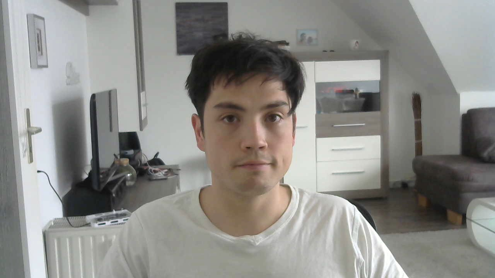
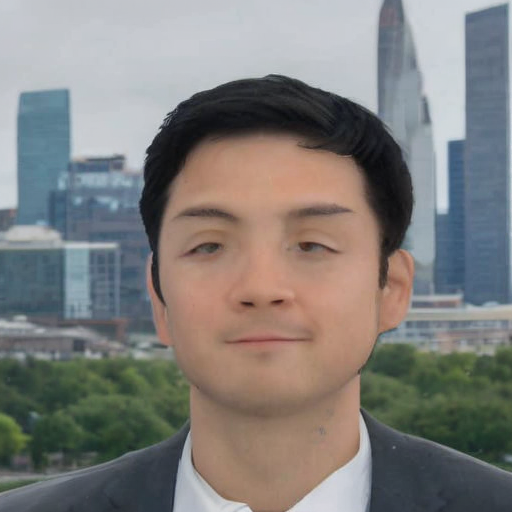

The following Notebook shows some experience with dreambooth. To goal was to create images which could be used on LinkedIn or for a CV.

Results are quite underwhelming.
I used a round one hundred images of myself for the fine-tuning. Below you can see an example for the training data. 

# Experimence 

## 1. Feeding the raw training data into fine-tuning
The result was:
* 
Prompt: profile_LinkedIn profile of gustav person in a suit  
 
 
Prompt: profile_ clean shaved gustav person  
 
 
## 1. Preprocessing the images so that the background is removed
  
 

